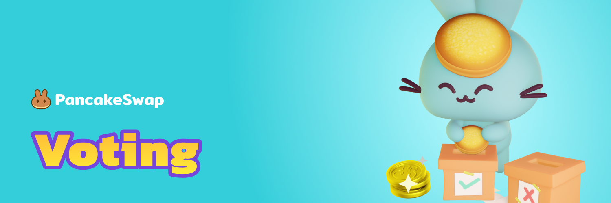

# 🗳 Voting

Voting gives a voice to the DutySwap community, letting the community have a say in how DutySwap develops into the future.

Check out [DutySwap's native voting portal](https://voting.duty.exchange/?\_gl=1\*pc8o0h\*\_ga\*MTUzNDEzNDQxMy4xNjAwNzkzNDM4\*\_ga\_334KNG3DMQ\*MTYwNDMwMTk4Ni42MC4xLjE2MDQzMDM3MDIuMA..#/) on the DutySwap website.

**Core** - proposals posted by the DutySwap team. The results will be actioned.

**Community** - proposals posted by the DutySwap community. These are used to propose ideas and show the communities point of view. The DutySwap team reviews every community vote and will often move any with strong community support up to the CORE proposal level.
