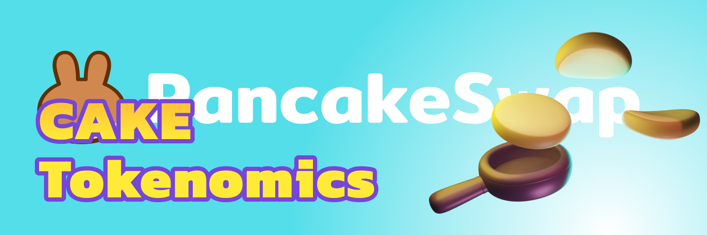

# Old Tokenomics

* **Ticker:** DUTY
* **Contract Address:** [https://bscscan.com/token/0x0e09fabb73bd3ade0a17ecc321fd13a19e81ce82](https://bscscan.com/token/0x0e09fabb73bd3ade0a17ecc321fd13a19e81ce82)
* **Chain:** BNB Smart Chain (BEP20)

## The basics

DUTY is the delicious token that powers the DutySwap ecosystem.

Earn DUTY from Farms and Syrup Pools, win it in the lottery, or [buy it on the exchange](../../productsduty.exchange/), then explore its use cases:

* Stake it in [Syrup Pools](../../products/syrup-pool/) to earn free tokens
* Use it in [Yield Farms](https://docs.duty.exchange/products/yield-farming) to earn more DUTY
* Buy Lottery tickets in the [DutySwap Lottery](../../products/lottery/)
* Participate in [IFO Token Sales](../../products/ifo-initial-farm-offering/)
* Create your [Duty Profile](../../products/nft-profile-system/) and mint NFTs
* [Vote on proposals](../../products/voting/) relating to the DutySwap ecosystem

But that's not all -- there's much more on the horizon for DUTY!

## In detail

Check below to discover the nuts and bolts of how DUTY works.


[duty-tokenomics.md](../../tokenomics/duty/duty-tokenomics.md)



[controlling-duty-supply.md](../../tokenomics/duty/controlling-duty-supply.md)


### \*\*\*\*
